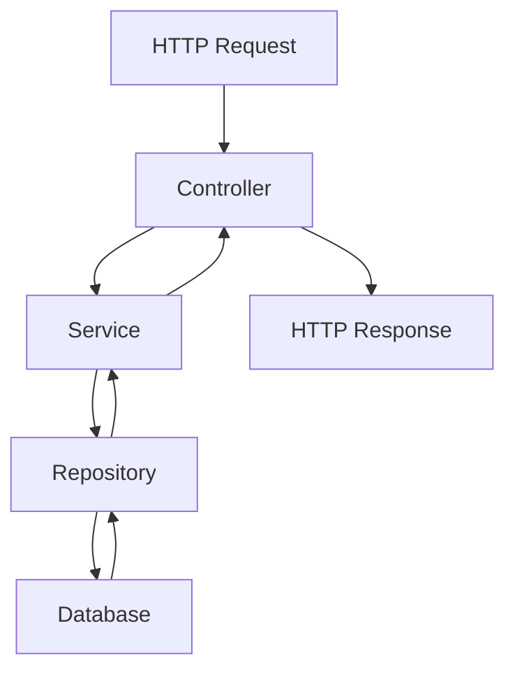

# 🏗️ Arquitetura do Projeto - Barbearia Hoshirara

Documentação completa da arquitetura full-stack moderna da aplicação.

## 📋 Visão Geral

Sistema completo de gestão de barbearia com arquitetura modular, seguindo princípios de Clean Architecture e Domain-Driven Design.

## 🎯 Stack Tecnológica

### 🌐 **Frontend**
- **React 18** + **TypeScript**
- **Vite** (Build tool)
- **React Router** (Roteamento)
- **Context API** (Estado global)
- **CSS Modules** (Styling)

### 🔧 **Backend** 
- **Node.js** + **Express**
- **TypeScript**
- **SQLite** (Database)
- **JWT** (Autenticação)
- **Swagger** (Documentação API)

### 🐳 **DevOps**
- **Docker** + **Docker Compose**
- **Nginx** (Reverse proxy)
- **Health Checks** automáticos

## 📁 Estrutura do Projeto

```
🏗️ barbearia-hoshirara/
├── 🌐 frontend/                  # React + TypeScript
│   ├── 📱 src/
│   │   ├── 🧩 components/        # Componentes React
│   │   ├── 📄 pages/             # Páginas da aplicação
│   │   ├── 🌐 services/          # API Layer (Modular)
│   │   ├── 🔗 contexts/          # Estado global
│   │   ├── 🎣 hooks/             # Custom hooks
│   │   ├── 📊 types/             # TypeScript types
│   │   └── 🎨 styles/            # Estilos CSS
│   ├── 🐳 Dockerfile
│   └── ⚙️ nginx.conf
│
├── 🔧 backend/                   # Node.js + Express
│   ├── 📂 src/
│   │   ├── 👥 clientes/          # Módulo Clientes
│   │   │   ├── dto.ts            # Data Transfer Objects
│   │   │   ├── entity.ts         # Database Entities
│   │   │   ├── repository.ts     # Data Access Layer
│   │   │   ├── service.ts        # Business Logic
│   │   │   ├── controller.ts     # HTTP Controllers
│   │   │   └── index.ts          # Exports
│   │   ├── ✂️ barbeiros/          # Módulo Barbeiros
│   │   ├── 💈 servicos/          # Módulo Serviços
│   │   ├── 📅 agendamentos/      # Módulo Agendamentos
│   │   ├── 💰 financeiro/        # Módulo Financeiro
│   │   ├── 🔐 auth/              # Módulo Autenticação
│   │   ├── 📊 relatorios/        # Módulo Relatórios
│   │   ├── 🤝 shared/            # Utilitários compartilhados
│   │   └── 🚀 server.ts          # Entrada da aplicação
│   ├── 🐳 Dockerfile
│   └── 💾 database.sqlite
│
├── 🐳 docker-compose.yml         # Orquestração completa
├── 📚 DOCKER.md                  # Documentação Docker
├── 🌐 FRONTEND-STRUCTURE.md      # Arquitetura Frontend
└── 🏗️ README.md                 # Este arquivo
```

## 🎨 Arquitetura Frontend

### 📦 **Modularização da API**
Estrutura organizada por domínios de negócio:

```typescript
🌐 services/api/
├── 🔗 client.ts         # HttpClient base
├── 👥 clientes.ts       # API de clientes
├── ✂️ barbeiros.ts      # API de barbeiros  
├── 💈 servicos.ts       # API de serviços
├── 📅 agendamentos.ts   # API de agendamentos
├── 💰 financeiro.ts     # API financeira
└── 🔐 auth.ts           # API de autenticação
```

### 🔄 **Estado Global**
Contexts organizados por responsabilidade:

```typescript
🔗 contexts/
├── 📱 AppContext.tsx    # Estado da aplicação
└── 🔐 AuthContext.tsx   # Estado de autenticação
```

## 🏗️ Arquitetura Backend

### 📐 **Clean Architecture**
Cada módulo segue o padrão de camadas:

```typescript
📂 [modulo]/
├── 📋 dto.ts           # Interface de entrada/saída
├── 🗄️ entity.ts        # Modelo do banco de dados
├── 💾 repository.ts    # Acesso aos dados
├── 💼 service.ts       # Lógica de negócio
├── 🎮 controller.ts    # Controladores HTTP
└── 📤 index.ts         # Exportações
```

### 🔄 **Fluxo de Dados**


## 🐳 Docker & Deploy

### 🚀 **Desenvolvimento Local**
```bash
# Frontend (desenvolvimento)
cd frontend && npm run dev

# Backend (desenvolvimento)  
cd backend && npm run dev
```

### 📦 **Produção com Docker**

#### Sistema Completo (Recomendado)
```bash
# Frontend + Backend + PostgreSQL
docker-compose up -d --build

# Ver status
docker-compose ps

# Ver logs
docker-compose logs frontend
docker-compose logs backend
docker-compose logs postgres

# Parar tudo
docker-compose down
```

#### Apenas Backend + PostgreSQL
```bash
# Para desenvolvimento frontend local
docker-compose -f docker-compose.backend-only.yml up -d --build

# Parar
docker-compose -f docker-compose.backend-only.yml down
```

### 🌐 **URLs da Aplicação**
- **Frontend Docker**: http://localhost:5173
- **Frontend Dev**: http://localhost:5174
- **Backend API**: http://localhost:3001/api
- **Swagger Docs**: http://localhost:3001/api-docs
- **Health Check**: http://localhost:3001/health
- **PostgreSQL**: localhost:5432 (postgres/postgres123)

### 🔧 **Containers**
- **Frontend**: React + Vite + Nginx (Porta 5173)
- **Backend**: Node.js + Express + TypeScript (Porta 3001)
- **Database**: PostgreSQL 15 + Auto-init (Porta 5432)

## 🎯 Princípios de Design

### ✅ **SOLID Principles**
- **S**ingle Responsibility: Cada classe tem uma responsabilidade
- **O**pen/Closed: Aberto para extensão, fechado para modificação
- **L**iskov Substitution: Subtipos substituíveis pelos tipos base
- **I**nterface Segregation: Interfaces específicas e coesas
- **D**ependency Inversion: Dependa de abstrações, não implementações

### 📐 **Clean Architecture**
- **Domain Layer**: Entidades e regras de negócio
- **Use Cases**: Casos de uso da aplicação
- **Interface Adapters**: Controllers, presenters, gateways
- **Infrastructure**: Framework, database, external services

### 🏗️ **Modular Design**
- Módulos independentes e coesos
- Baixo acoplamento entre módulos
- Alta coesão dentro dos módulos
- Fácil testabilidade e manutenção

## 🧪 Qualidade de Código

### 📊 **TypeScript Strict Mode**
- Tipagem rigorosa em todo o projeto
- Interfaces bem definidas
- Null safety garantido
- IntelliSense aprimorado

### 🔍 **Error Handling**
- Try/catch padronizados
- Logs estruturados
- Status codes apropriados
- Mensagens de erro consistentes

### 🛡️ **Security**
- JWT para autenticação
- Validação de entrada
- Rate limiting
- CORS configurado
- Sanitização de dados

## 📈 Performance

### ⚡ **Frontend**
- Code splitting automático
- Lazy loading de rotas
- Otimização de re-renders
- Cache de API calls

### 🚀 **Backend**
- Prepared statements (SQL injection prevention)
- Connection pooling
- Middleware de cache
- Compressão gzip

### 🐳 **Docker**
- Multi-stage builds
- Layer caching
- Minimal base images
- Health checks

## 🔄 Fluxo de Desenvolvimento

### 1. **Development**
```bash
# Terminal 1: Backend
cd backend && npm run dev

# Terminal 2: Frontend
cd frontend && npm run dev
```

### 2. **Testing**
```bash
# Testes unitários
npm test

# Testes e2e
npm run test:e2e
```

### 3. **Build & Deploy**
```bash
# Docker completo
docker-compose up -d --build

# Ou scripts personalizados
./docker.bat start  # Windows
./docker.sh start   # Linux/Mac
```

## 📚 Documentação Adicional

- 📖 [**Frontend Structure**](FRONTEND-STRUCTURE.md) - Arquitetura detalhada do frontend
- 🐳 [**Docker Setup**](DOCKER.md) - Configuração completa do Docker
- 📊 [**API Documentation**](http://localhost:3001/api-docs) - Swagger docs (quando rodando)

## 🤝 Contribuição

### 📋 **Padrões de Código**
1. Seguir a estrutura modular estabelecida
2. Tipagem TypeScript obrigatória
3. Nomenclatura consistente
4. Documentação de APIs
5. Testes para novas funcionalidades

### 🔄 **Workflow**
1. Feature branch do `master`
2. Implementação seguindo arquitetura
3. Testes unitários
4. Pull request com review
5. Merge após aprovação

---

> 💡 **Esta arquitetura garante escalabilidade, manutenibilidade e facilidade de desenvolvimento para toda a equipe!**