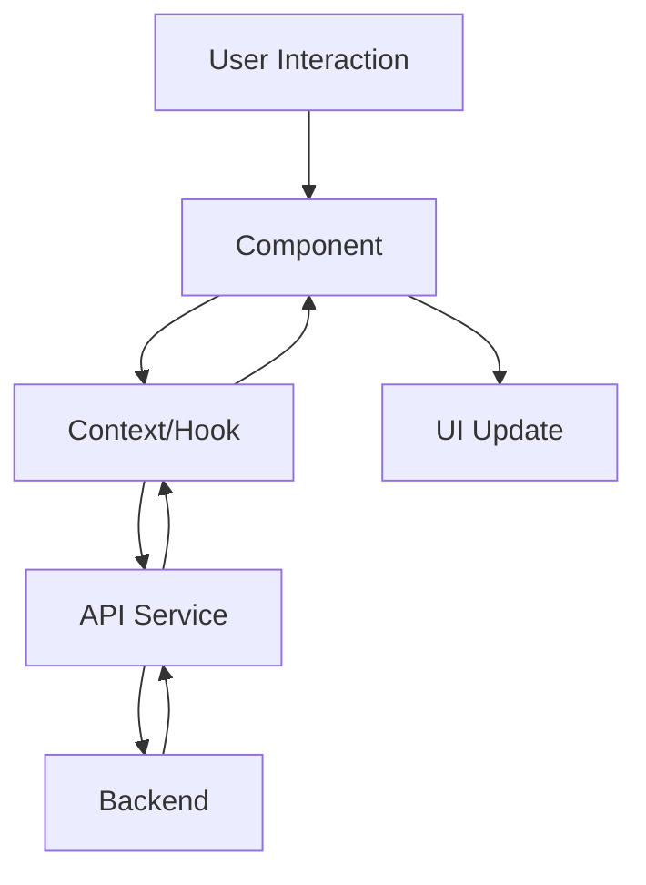

# 🌐 Frontend - Estrutura do Projeto

Estrutura moderna e organizada do frontend da Barbearia Hoshirara usando React + Vite + TypeScript.

## 📁 Estrutura de Diretórios

```
🌐 frontend/src/
├── 📱 components/                # Componentes React organizados
│   ├── 🏠 MainLayout.tsx        # Layout principal da aplicação
│   ├── 🛡️ ProtectedRoute.tsx    # Rota protegida por autenticação
│   ├── 📱 MobileNavBar.tsx      # Navegação mobile responsiva
│   ├── 🪟 Modal.tsx             # Modal genérico reutilizável
│   ├── 📋 common/               # Componentes comuns
│   │   ├── 👤 ClienteForm.tsx   # Formulário de clientes
│   │   ├── ✂️ BarbeiroForm.tsx   # Formulário de barbeiros
│   │   ├── 💈 ServicoForm.tsx    # Formulário de serviços
│   │   └── 💰 MovimentacaoForm.tsx # Formulário financeiro
│   └── 🎨 Sidebar/              # Componentes da sidebar
│       └── Sidebar.tsx          # Menu lateral principal
│
├── 📄 pages/                    # Páginas da aplicação (Views)
│   ├── 🏠 Dashboard.tsx         # Dashboard principal
│   ├── 👥 Clientes.tsx          # Gestão de clientes
│   ├── ✂️ Barbeiros.tsx          # Gestão de barbeiros
│   ├── 💈 Servicos.tsx          # Gestão de serviços
│   ├── 📅 Agendamentos.tsx      # Sistema de agendamentos
│   ├── 💰 Financeiro.tsx        # Controle financeiro
│   ├── ⏰ Horarios.tsx          # Gestão de horários
│   ├── 📊 Relatorios.tsx        # Relatórios e analytics
│   ├── ⚙️ Configuracoes.tsx     # Configurações do sistema
│   ├── 🔐 Login.tsx             # Tela de login
│   └── 📝 Register.tsx          # Tela de cadastro
│
├── 🌐 services/                 # Camada de API (Arquitetura Modular)
│   ├── 📡 api.ts                # Cliente API principal (compatibilidade)
│   └── 🎯 api/                  # Módulos específicos da API
│       ├── 🔗 client.ts         # HttpClient base
│       ├── 📊 index.ts          # Exportações centralizadas
│       ├── 👥 clientes.ts       # API de clientes
│       ├── ✂️ barbeiros.ts       # API de barbeiros
│       ├── 💈 servicos.ts        # API de serviços
│       ├── 📅 agendamentos.ts   # API de agendamentos
│       ├── 💰 financeiro.ts     # API financeira
│       └── 🔐 auth.ts           # API de autenticação
│
├── 🔗 contexts/                 # Context API para estado global
│   ├── 📱 AppContext.tsx        # Estado global da aplicação
│   └── 🔐 AuthContext.tsx       # Estado de autenticação
│
├── 🎣 hooks/                    # Custom Hooks React
│   └── 📱 useApp.ts             # Hook para usar AppContext
│
├── 📊 types/                    # Definições TypeScript
│   ├── 📋 index.ts              # Tipos principais exportados
│   └── 🔗 context.ts            # Tipos dos contexts
│
├── 🎨 styles/                   # Estilos da aplicação
│   └── globals.css              # Estilos globais CSS
│
├── 🖼️ assets/                   # Recursos estáticos
│   └── (imagens, ícones, etc.)
│
└── 🛠️ utils/                    # Utilitários e helpers
    └── (funções auxiliares)
```

## 🏗️ Arquitetura por Camadas

### 🎨 **Presentation Layer** (Components + Pages)
- **Components**: Componentes reutilizáveis e específicos
- **Pages**: Views principais da aplicação
- Responsabilidade: Interface do usuário e interação

### 🔗 **State Management** (Contexts + Hooks)
- **Contexts**: Estado global compartilhado
- **Hooks**: Lógica de estado reutilizável
- Responsabilidade: Gerenciamento de estado

### 🌐 **Service Layer** (Services/API)
- **API Modules**: Comunicação com backend
- **HttpClient**: Cliente HTTP base
- Responsabilidade: Integração com APIs externas

### 📊 **Domain Layer** (Types)
- **Type Definitions**: Contratos de dados
- **Interfaces**: Estruturas de dados
- Responsabilidade: Definição de modelos

## 🎯 Padrões Arquiteturais

### 📦 **Modularização da API**
```typescript
// Antes: Monolítico
import { api } from './services/api';

// Depois: Modular
import { clientesApi } from './services/api/clientes';
import { barbeirosApi } from './services/api/barbeiros';
```

### 🔄 **Context Pattern**
```typescript
// Estado global organizado
const AppContext = createContext<AppContextType>();
const AuthContext = createContext<AuthContextType>();
```

### 🎨 **Component Composition**
```typescript
// Componentes compostos
<MainLayout>
  <ProtectedRoute>
    <Dashboard />
  </ProtectedRoute>
</MainLayout>
```

## 🛠️ Tecnologias Utilizadas

### ⚡ **Build & Development**
- **Vite**: Build tool rápido
- **TypeScript**: Tipagem estática
- **React 18**: Biblioteca UI
- **React Router**: Roteamento SPA

### 🎨 **Styling & UI**
- **CSS Modules**: Estilos escotados
- **Responsive Design**: Mobile-first
- **Component Library**: Componentes reutilizáveis

### 🔧 **Development Tools**
- **ESLint**: Linting de código
- **Hot Reload**: Desenvolvimento ágil
- **TypeScript Strict**: Tipagem rigorosa

## 📁 Convenções de Nomenclatura

### 📄 **Arquivos**
- **Components**: `PascalCase.tsx`
- **Pages**: `PascalCase.tsx` 
- **Services**: `camelCase.ts`
- **Types**: `camelCase.ts`
- **Contexts**: `PascalCase.tsx`

### 🏷️ **Variáveis**
- **Components**: `PascalCase`
- **Functions**: `camelCase`
- **Constants**: `UPPER_SNAKE_CASE`
- **Types/Interfaces**: `PascalCase`

## 🔄 Fluxo de Dados



## 🎯 Responsabilidades por Camada

### 🎨 **Components**
- Renderização de UI
- Gerenciamento de estado local
- Interação com usuário
- Validação de formulários

### 🔗 **Contexts**
- Estado global da aplicação
- Autenticação de usuários
- Cache de dados
- Comunicação entre componentes

### 🌐 **Services**
- Comunicação HTTP
- Transformação de dados
- Tratamento de erros
- Cache de requisições

### 📊 **Types**
- Definição de contratos
- Validação de tipos
- Documentação de APIs
- IntelliSense no IDE

## 🚀 Vantagens da Arquitetura

### ✅ **Manutenibilidade**
- Código organizado por responsabilidade
- Componentes reutilizáveis
- Tipagem forte com TypeScript
- Padrões consistentes

### ⚡ **Performance**
- Lazy loading de componentes
- Code splitting automático
- API calls otimizadas
- Estado gerenciado eficientemente

### 🧪 **Testabilidade**
- Componentes isolados
- Services mockáveis
- Estado previsível
- Lógica de negócio separada

### 👥 **Escalabilidade**
- Estrutura modular
- Fácil adição de features
- Time pode trabalhar em paralelo
- Documentação clara

## 📋 Próximos Passos

1. **🧪 Testing**: Implementar testes unitários e e2e
2. **🎨 Design System**: Criar biblioteca de componentes
3. **📊 State Management**: Considerar Zustand/Redux se necessário
4. **🚀 Performance**: Otimizações e lazy loading
5. **📱 PWA**: Transformar em Progressive Web App